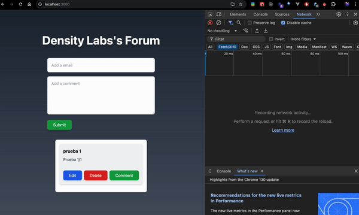

# Density Labs's Forum

## Descripción

Density Labs's Forum es una aplicación web construida con React y TypeScript que permite a los usuarios agregar, editar y eliminar comentarios en un foro. La aplicación utiliza Tailwind CSS para el diseño y estilo de los componentes.

## Características

- Agregar comentarios
- Editar comentarios
- Eliminar comentarios
- Interfaz de usuario estilizada con Tailwind CSS
- Gestión de estado global con Context API
- Interceptores de Axios para manejar solicitudes HTTP

## Tecnologías Utilizadas

- React
- TypeScript
- Tailwind CSS
- npm
- Axios

## Ejemplo de Uso



## Instalación

1. Clona el repositorio:
    ```bash
    git clone https://github.com/tu-usuario/density-labs-forum.git
    ```
2. Navega al directorio del proyecto:
    ```bash
    cd density-labs-forum
    ```
3. Instala las dependencias:
    ```bash
    npm install
    ```

## Uso

1. Inicia la aplicación:
    ```bash
    npm start
    ```
2. Abre tu navegador y navega a `http://localhost:3000` para ver la aplicación en funcionamiento.

## Estructura del Proyecto

- `src/`
  - `components/`: Contiene los componentes reutilizables de la aplicación.
    - `Layout.tsx`: Componente principal que maneja la estructura del foro.
    - `AddComment.tsx`: Componente para agregar nuevos comentarios.
    - `Card.tsx`: Componente que muestra los comentarios y permite editarlos o eliminarlos.
    - `ActionButton.tsx`: Botón reutilizable para diferentes acciones.
    - `EditComment.tsx`: Componente para editar comentarios existentes.
  - `services/`: Contiene los archivos relacionados con Axios.
    - `ServicesContext.tsx`: Configuración de Axios y definición de interceptores.
  - `App.tsx`: Punto de entrada principal de la aplicación.
  - `index.tsx`: Archivo de entrada que renderiza la aplicación en el DOM.

## Uso de Context API

La aplicación utiliza Context API para gestionar el estado global de los comentarios. El archivo `CommentContext.tsx` define un contexto y un proveedor que envuelve la aplicación, permitiendo que los componentes accedan y actualicen el estado de los comentarios de manera eficiente.

## Interceptores de Axios

La aplicación utiliza interceptores de Axios para manejar solicitudes HTTP. El archivo `axiosConfig.ts` configura Axios y define interceptores para agregar encabezados de autenticación y manejar errores de manera centralizada.
